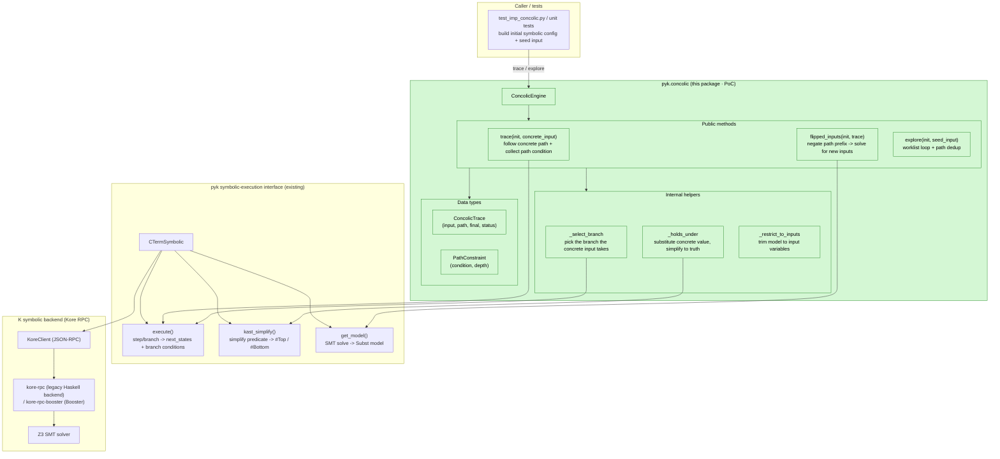
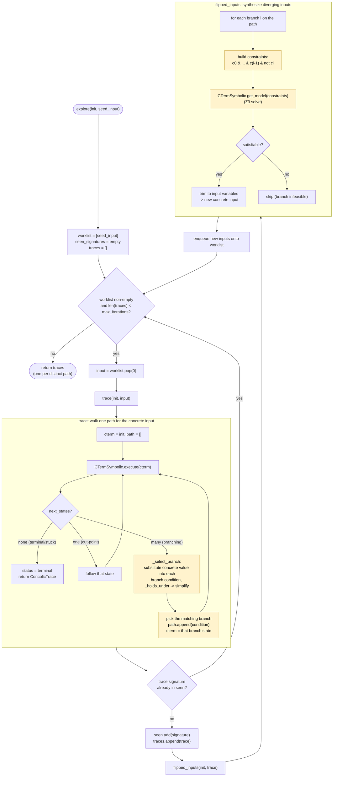

# Concolic execution (proof-of-concept)

This package is a **proof-of-concept** concolic (concrete + symbolic) execution engine
built on top of pyk's existing symbolic-execution interface, `CTermSymbolic`.

It does **not** add a new backend. It orchestrates the K symbolic backend (Kore RPC /
Haskell backend or Booster) to follow the single path picked out by a *concrete* input,
records the branch conditions encountered along that path (the *path condition*), and then
uses the backend's SMT solver to synthesize new concrete inputs that drive execution down
previously unexplored branches — the classic DART/SAGE loop.

## How it works

Given an initial symbolic configuration with some free *input variables* and a concrete
assignment to them, `ConcolicEngine` does three things:

1. **`trace(init, concrete_input)`** — Steps the configuration with `CTermSymbolic.execute`.
   At each branch point, it substitutes the concrete input into each candidate branch
   condition and simplifies it; the branch that simplifies to `#Top` is the one the concrete
   input takes. The taken conditions accumulate into the trace's *path condition*.

2. **`flipped_inputs(init, trace)`** — For each branch `i` along the recorded path, it builds
   the constraint set `c_0 & … & c_(i-1) & ¬c_i` and asks `CTermSymbolic.get_model` for a
   satisfying assignment over the input variables. Each feasible model is a new concrete input
   that diverges from `trace` at branch `i`.

3. **`explore(init, seed_input)`** — A bounded worklist loop: trace an input, enqueue the
   inputs produced by flipping its branches, skip inputs whose path condition was already seen,
   and stop after `max_iterations`. The result is one trace per distinct path discovered.

## Architecture

The engine adds no new backend; it orchestrates pyk's existing `CTermSymbolic` interface, which
talks to a running Kore RPC server (the legacy Haskell backend or Booster) and its SMT solver.



## Exploration flow



## Example

For the one-branch IMP program

```
if (n <= 5) { found = 1 ; } else { found = 0 ; }
```

with `n` symbolic, seeding the engine with `n = 10` (the `else` branch) yields a flipped input
`n ≤ 5` (the `then` branch), and `explore` discovers both feasible paths. See
`src/tests/integration/concolic/test_imp_concolic.py` for the end-to-end version and
`src/tests/unit/test_concolic.py` for a toolchain-free unit test of the orchestration logic.

## Scope and limitations

This is a deliberately small PoC:

- **Single concrete path per trace.** Branch selection assumes branches are mutually exclusive
  and that the concrete input determines exactly one (true for ground integer guards like the
  IMP example).
- **No coverage metric or smart search heuristic.** `explore` is a plain breadth-first
  worklist bounded by `max_iterations`; it is not coverage-guided.
- **No CLI yet.** The engine is a library only. A `kpyk concolic` entry point and a
  coverage-guided search strategy are natural follow-ups.
- **Loops/recursion** are bounded only by `max_step` / `max_branches`; unbounded loops are not
  handled specially.

## Running the tests

```
# Toolchain-free unit test of the engine orchestration (run from pyk/)
uv run -- pytest src/tests/unit/test_concolic.py

# End-to-end test (run from pyk/; needs a `kompile` + Kore RPC server matching this source
# tree -- e.g. `kup install k --version v7.1.322`). Exercises both the legacy Haskell backend
# and the Booster server.
uv run -- pytest src/tests/integration/concolic/test_imp_concolic.py
```
