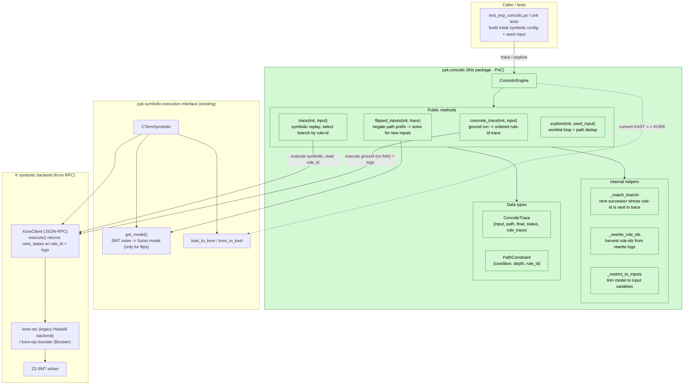
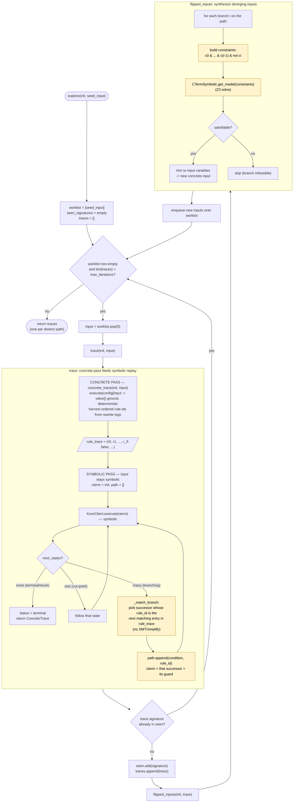

# Concolic execution (proof-of-concept)

This package is a **proof-of-concept** concolic (concrete + symbolic) execution engine
built on top of pyk's existing symbolic-execution interface, `CTermSymbolic`.

> **Design & roadmap:** see [`DESIGN.md`](DESIGN.md) for the target architecture (the
> remainder-driven DART loop and the Haskell guided-step backend feature). This README documents
> what is implemented today.

It does **not** add a new backend. The defining idea is that a fast, deterministic *concrete*
run produces an execution trace, which is then **reused** to drive a *symbolic* run down the
very same path. Because the concrete trace already records which rule fired at every branch, the
symbolic pass selects each branch by **matching rule ids** — it never asks the SMT solver "which
branch does this input take?". The solver is consulted only at the end, to negate a prefix of
the path condition and synthesize a new input (the classic DART/SAGE loop).

## How it works

Both passes run against the **same** Kore backend, so rule ids share one namespace. Given an
initial symbolic configuration with free *input variables* and a concrete assignment to them:

1. **`concrete_trace(init, concrete_input)`** — Substitute the concrete input into the
   configuration and execute. With the branch-relevant data ground, the run is **deterministic
   (no forking)**, and the ordered rule ids applied are harvested from the rewrite logs. This is
   the *concrete trace*.

2. **`trace(init, concrete_input)`** — Execute with the input left **symbolic**. At each branch,
   follow the successor whose `rule_id` appears next in the concrete trace, recording its guard
   as a path constraint. Branch selection is an O(1) rule-id lookup — **no per-branch SMT /
   simplify call**. (This pass uses the lower-level `KoreClient` directly, because the
   `CTermSymbolic` wrapper drops `rule_id` from successors.)

3. **`flipped_inputs(init, trace)`** — For each branch `i` along the recorded path, build the
   constraint set `c_0 & … & c_(i-1) & ¬c_i` and ask `CTermSymbolic.get_model` for a satisfying
   assignment over the input variables. Each feasible model is a new concrete input that diverges
   from `trace` at branch `i`.

4. **`explore(init, seed_input)`** — A bounded worklist loop: trace an input, enqueue the inputs
   produced by flipping its branches, skip inputs whose path condition was already seen, and stop
   after `max_iterations`. The result is one trace per distinct path discovered.

### Why reuse the trace?

Without the concrete trace, the symbolic engine would have to *decide* at each branch which side
a given input takes — i.e. substitute the value and call the solver/simplifier per candidate.
Reusing the concrete trace replaces that work with a cheap rule-id lookup, and keeps the
expensive solver on the critical path only once per new input (the flip).

> **Honest scope:** this reuses the concrete trace for *branch selection*. The symbolic backend
> still computes the branch split itself (it returns both successors at a branch over the RPC);
> we do not yet stop it from forking. Eliminating that forking entirely would require either
> *concretizing* the branch-deciding term or backend-level support to apply a chosen rule — see
> *Scope and limitations*.

## Architecture

The engine adds no new backend; it orchestrates pyk's existing `CTermSymbolic` interface, which
talks to a running Kore RPC server (the legacy Haskell backend or Booster) and its SMT solver.



## Exploration flow



## Example

For the one-branch IMP program

```
if (n <= 5) { found = 1 ; } else { found = 0 ; }
```

with `n` symbolic, seeding the engine with `n = 10` (the `else` branch) yields a flipped input
`n ≤ 5` (the `then` branch), and `explore` discovers both feasible paths. See
`src/tests/integration/concolic/test_imp_concolic.py` for the end-to-end version and
`src/tests/unit/test_concolic.py` for a toolchain-free unit test of the orchestration logic.

## Scope and limitations

This is a deliberately small PoC:

- **Single concrete path per trace.** Branch selection assumes branches are mutually exclusive
  and that the concrete input determines exactly one (true for ground integer guards like the
  IMP example).
- **No coverage metric or smart search heuristic.** `explore` is a plain breadth-first
  worklist bounded by `max_iterations`; it is not coverage-guided.
- **No CLI yet.** The engine is a library only. A `kpyk concolic` entry point and a
  coverage-guided search strategy are natural follow-ups.
- **Loops/recursion** are bounded only by `max_step` / `max_branches`; unbounded loops are not
  handled specially.

## Running the tests

```
# Toolchain-free unit test of the engine orchestration (run from pyk/)
uv run -- pytest src/tests/unit/test_concolic.py

# End-to-end test (run from pyk/; needs a `kompile` + Kore RPC server matching this source
# tree -- e.g. `kup install k --version v7.1.322`). Exercises both the legacy Haskell backend
# and the Booster server.
uv run -- pytest src/tests/integration/concolic/test_imp_concolic.py
```
